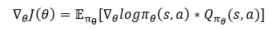

This code explain about TD actor critic.

We will explain with the assumption that we have studied policy gradient. Please refer to the below equation for the policy gradient equation.  

  

Briefly explaining the policy gradient equation, which was discussed in detail earlier, the equation &#8711;&theta;J(&theta;) can be said to calculate the loss value to learn the parameters of the deep learning model. &#8711;&theta; in the right equation is the amount of change in the reward value according to the parameters. &#960;&theta;(s,a) is policy Q&#960;&theta;(s,a) is cumulative reward. If you don't understand this explanation well, please refer to the previous explaination.

It is possible to derive an Advantage Actor-critic equation by using a policy gradient equation. In short, this was also derived by applying A&#960;&theta;(s,a) ~ Q&#960;&theta;(s,a)-V&#960;&theta;(s). We will post the detailed proof later.

The above equation is proved through &delta;=r+&gamma;V(s')-V(s). As a result, we can use algorithms that can update policies with only n-step calculations and value-based functions. 
Based on this understanding, let's check the sample code.

thank you